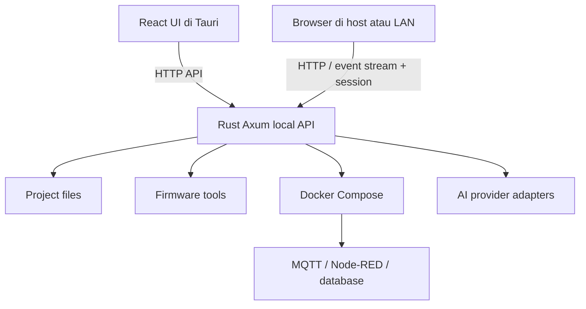

# Rancangan Arsitektur — IoTKit-Studio Desktop

## Arah

IoTKit-Studio Desktop memperluas produk web yang ada. Backend Rust lokal menangani kebutuhan host. UI bersama dapat berjalan di jendela Tauri atau dibuka di browser. Backend web Go/Node.js dan PostgreSQL tetap berjalan selama belum ada keputusan migrasi.

## Komponen

| Komponen | Teknologi awal | Tanggung jawab |
|---|---|---|
| UI | React + TypeScript + Vite | Workspace, pengaturan, editor, dashboard, log |
| Desktop | Tauri 2 | Distribusi, lifecycle, izin native |
| Local core/API | Rust + Tokio + Axum | API proyek, status, operasi tool, event stream |
| Metadata | SQLite | Recent projects dan preferensi non-secret |
| Secrets | OS credential store | API key dan token sensitif |
| Firmware | ESP32 + Arduino CLI (keputusan kerja; perlu diuji) | Build, flash, serial monitor |
| Layanan proyek | Docker Compose | Broker, Node-RED, database, servis proyek |
| AI | Adapter provider | Provider/model, koneksi, error, request |

## Proses

Browser dan UI Tauri memakai kontrak API yang sama untuk fitur bersama. Logika proyek tidak boleh diduplikasi di React. Tauri commands hanya untuk integrasi native yang tidak cocok diekspos lewat HTTP API.

## Network dan keamanan

- Default API hanya listen pada loopback.
- LAN opt-in, alamat/interface jelas, sesi pairing/token, origin validation, pembatasan request, dan revoke.
- Akses remote dasar untuk monitoring/workspace; flash board, perubahan layanan persisten, dan operasi sensitif perlu approval host.
- Jangan membuka Docker Engine socket/API ke LAN. Rust menjalankan Compose melalui integrasi lokal terbatas.
- Secret tidak disimpan di SQLite biasa, URL, repo, project file, atau log.
- Minta konfirmasi sebelum flash board, menghapus/mengganti banyak file, atau mengubah layanan/data persisten.

## API konseptual

- `GET /api/v1/health` — status kesiapan dan versi.
- `GET/POST /api/v1/projects` — daftar dan buat proyek.
- `GET /api/v1/projects/{id}/files` — file dalam workspace.
- `POST /api/v1/ai/plan` — rencana terstruktur dari prompt.
- `POST /api/v1/ai/changes/{id}/apply` — terapkan diff yang disetujui.
- `GET /api/v1/providers` dan `POST /api/v1/providers/{id}/test` — konfigurasi tanpa mengembalikan secret dan test koneksi.
- `GET /api/v1/events` — status/log melalui SSE; evaluasi WebSocket bila perlu interaksi dua arah.
- `POST /api/v1/runtime/{project}/start|stop` — kontrol runtime yang divalidasi.

Endpoint final ditetapkan melalui desain teknis. Mutasi harus memvalidasi sesi, request, dan izin.

## AI dan eksekusi

AI mengembalikan tujuan, daftar file, patch, validasi, dan tindakan yang diusulkan. Backend memastikan path berada di workspace, membuat snapshot, memvalidasi patch, lalu menunjukkan diff. File apply dan runtime action adalah langkah terpisah. Jangan jalankan string shell bebas; gunakan perintah terdaftar dengan argumen bertipe/allowlist dan log hasil aktual.

## Hubungan dengan web

MVP tidak menggabungkan database web dengan database lokal. Siapkan kontrak ekspor/impor dan adapter integrasi masa depan. Sinkronisasi akun, proyek, chat, atau telemetry membutuhkan keputusan privasi dan resolusi konflik tersendiri. Lihat [audit integrasi](INTEGRATION_AUDIT.md) dan [keputusan MVP](MVP_DECISIONS.md).
